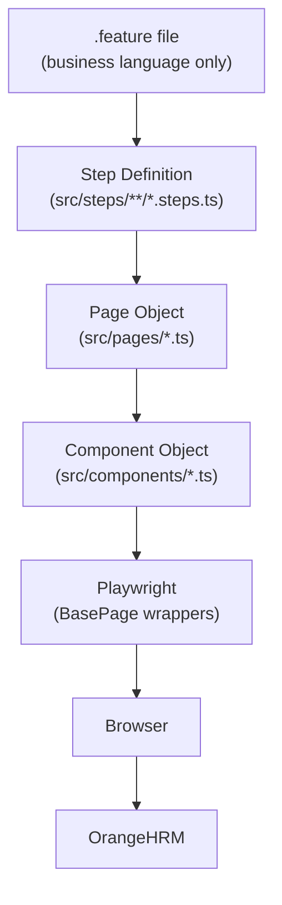
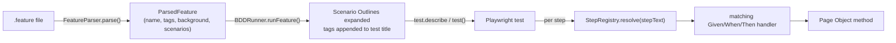
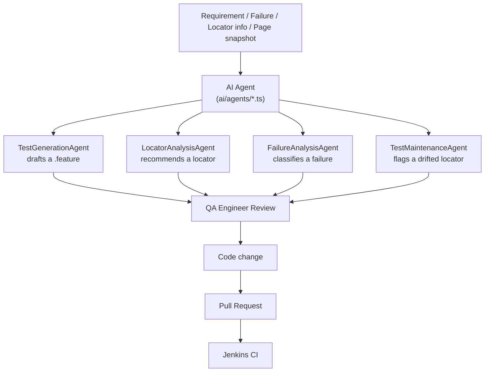
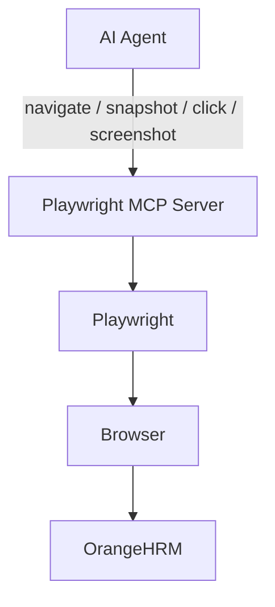
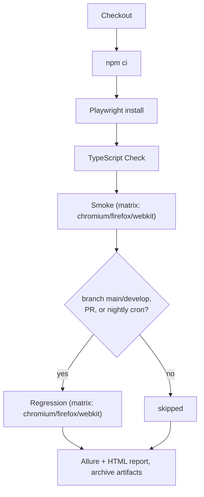
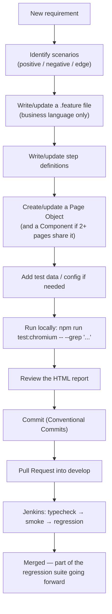

# OrangeHRM Playwright BDD Framework

An enterprise-style UI automation framework for [OrangeHRM's public demo](https://opensource-demo.orangehrmlive.com/web/index.php/auth/login), built with Playwright, TypeScript, a **hand-written BDD engine** (no Cucumber dependency), and the Page Object Model. Every claim in this document was verified by actually running the framework against the real application — where something didn't work as expected, that's written down too, not smoothed over.

Demo credentials (published by the app itself): `Admin` / `admin123`.

---

## Table of Contents

1. [Architecture](#architecture)
2. [Technology Stack](#technology-stack)
3. [Folder Structure](#folder-structure)
4. [The BDD Engine](#the-bdd-engine)
5. [Page Object Model](#page-object-model)
6. [Component Object Model](#component-object-model)
7. [Test Data & Configuration](#test-data--configuration)
8. [Running Tests](#running-tests)
9. [Tags](#tags)
10. [Reports & Evidence](#reports--evidence)
11. [Logging & Debugging](#logging--debugging)
12. [Agentic AI Layer](#agentic-ai-layer)
13. [MCP](#mcp)
14. [Git Workflow](#git-workflow)
15. [Jenkins & CI/CD](#jenkins--cicd)
16. [Known Limitations](#known-limitations-read-this)
17. [Adding New Work](#adding-new-work)
18. [Interview-Ready Summary](#interview-ready-summary)

---

## Architecture



Each layer only talks to the one directly below it:

- A `.feature` file never contains a locator or a line of Playwright code.
- A step definition never contains a locator — only calls to a Page Object method.
- A Page Object owns its own locators and actions; it borrows shared locators from a Component only when a second page genuinely needs them.
- `BasePage` is the only place that calls raw Playwright APIs (`page.goto`, `locator.click`, ...).

## Technology Stack

| Concern | Choice |
|---|---|
| Browser automation | Playwright (`@playwright/test`) |
| Language | TypeScript, strict mode, `node16` module resolution |
| BDD | Hand-written engine (`src/bdd/`) — no `cucumber-js`, no `playwright-bdd` |
| Design pattern | Page Object Model + Component Object Model |
| Config | `dotenv` + per-environment TS config files |
| Reporting | Playwright HTML reporter + Allure (`allure-playwright`) |
| Logging | Custom `Logger` (console + `logs/test-run.log`) |
| CI/CD | Jenkins (declarative pipeline, cross-browser matrix) |
| AI layer | Hand-written agents (`ai/`), no framework/SDK, pluggable LLM client |

## Folder Structure

```
playwright-bdd-agentic-ai/
├── ai/                        Agentic AI layer (Phase 14/15) — advisory only, human-reviewed
│   ├── agents/                TestGeneration / LocatorAnalysis / FailureAnalysis / TestMaintenance
│   ├── prompts/                One .prompt.md template per agent
│   ├── config/ai.config.ts     Reads AI_API_KEY etc. from .env
│   ├── AIClient.ts              Pluggable LLM client (ships unconfigured — see "Agentic AI Layer")
│   ├── PromptTemplate.ts        Loads + fills {{placeholders}} in a prompt file
│   ├── ResponseParser.ts        Extracts KEY: value lines from a model response
│   └── mcp-architecture.md      MCP design doc (Phase 15)
├── config/
│   ├── environments/            dev / qa / prod baseURL config
│   └── framework.config.ts      THE single place that reads process.env
├── features/                   Gherkin — business language only
│   ├── authentication/login.feature
│   └── employee/employee.feature
├── src/
│   ├── bdd/                    The BDD engine itself (rarely touched)
│   │   ├── FeatureParser.ts     .feature text → ParsedFeature object
│   │   ├── StepRegistry.ts      Given/When/Then registration + matching
│   │   ├── BDDRunner.ts         Wires a parsed feature into Playwright test()
│   │   └── types.ts
│   ├── components/              Header.ts — shared across Dashboard + PIM
│   ├── pages/                   BasePage + one class per real page
│   ├── steps/                   Step definitions (frequently touched)
│   ├── fixtures/test.fixture.ts Playwright `test` extended with page-object fixtures
│   └── utils/                   Logger.ts, ScreenshotUtils.ts
├── tests/bdd/                   Thin entry points: import steps, call runFeature()
├── reports/                     Generated (git-ignored)
├── Jenkinsfile
├── playwright.config.ts
└── tsconfig.json
```

## The BDD Engine

No Cucumber. `src/bdd/` is three small, readable files:



- **`FeatureParser`** is the *only* file that reads `.feature` files — a line-by-line state machine, no external Gherkin library.
- **`StepRegistry`** compiles Cucumber-style patterns (`I login with username {string}`) into regex, and matches by **text only** — `Given`/`When`/`Then`/`And` are documentation for humans, not a routing key, exactly like real Cucumber.
- **`BDDRunner`** expands `Scenario Outline` + `Examples` into concrete test cases, and appends tags directly into the Playwright test title (`"... @smoke @authentication"`) so `--grep` does tag filtering for free — no custom tag-filter code exists anywhere.
- **A real Playwright constraint shapes this file**: Playwright statically inspects a test callback's parameter list to know which fixtures to inject. Neither a plain parameter nor a rest pattern (`{ ...world }`) is accepted — every fixture must be named explicitly:
  ```typescript
  test(title, async ({ page, loginPage, dashboardPage, forgotPasswordPage, pimPage, addEmployeePage }) => { ... })
  ```
  **When you add a new page-object fixture in `test.fixture.ts`, you must add its name here too**, or steps that destructure it get `undefined`. This was discovered the hard way in Phase 7 and has been documented in the code ever since.
- **A shared `context: {}` object** rides along in the `world` passed to every step — the same role Cucumber's `this` plays. Use it when one step needs to hand data to a later step in the same scenario (see `employee.steps.ts`, where the app-generated Employee Id is stashed after "add employee" and read back during "search for that employee").

## Page Object Model

```typescript
export class LoginPage extends BasePage {
  readonly usernameInput: Locator;
  // ...
  async login(username: string, password: string): Promise<void> {
    await this.enterUsername(username);
    await this.enterPassword(password);
    await this.clickLogin();
  }
}
```

- **`BasePage`** wraps generic Playwright actions (`click`, `fill`, `getText`, `waitForElement`, `navigate`, `takeScreenshot`, ...) and knows nothing about OrangeHRM.
- **Every locator was verified against the live application**, not guessed — e.g. the "Forgot your password?" link is a plain `<p>` with no ARIA role (confirmed by inspection), so it correctly uses `getByText` instead of `getByRole('link', ...)`, which would never match.
- **Locator priority**: `getByRole` → `getByLabel` → `getByPlaceholder` → `getByText` → `getByTestId` → a stable framework class (e.g. `.oxd-userdropdown-tab`, used only where the element has no ARIA role at all) → XPath (never used in this repo).
- **Assertions live in step definitions, not Page Objects.** A Page Object exposes locators and state getters (`isLoginPageDisplayed()`, `getErrorMessage()`); the actual `expect(...)` call is in the step, using Playwright's auto-retrying web-first assertions. `locator.isVisible()` does **not** auto-retry — a real bug hit in Phase 6 when checking the login page right after logout returned `false` because the check ran before the page rendered. Lesson: use `expect(locator).toBeVisible()` in tests, reserve `isVisible()` for non-critical conditional logic.
- **An action waits for the consequence of itself, not for a business outcome.** `DashboardPage.logout()`/`Header.logout()` wait for the resulting navigation to `/auth/login` — that's the action *completing*, not a test assertion. `LoginPage.login()` deliberately does **not** wait for a dashboard redirect, because it's also used by every negative-path scenario where no redirect happens.

Pages implemented: `BasePage`, `LoginPage`, `DashboardPage`, `ForgotPasswordPage`, `PIMPage`, `AddEmployeePage`. Only what's actually exercised by a real scenario — no speculative pages for modules nothing tests yet.

## Component Object Model

A Component Object is extracted **only once a second page genuinely needs the same locators** — never speculatively.

`src/components/Header.ts` is the one example so far: it started as locators directly inside `DashboardPage` (Phase 6, when Dashboard was the only authenticated page). Once `PIMPage` needed the identical user-dropdown/logout locators (Phase 13), they moved into `Header`, and both pages now hold `readonly header: Header` instead of duplicating `.oxd-userdropdown-tab`.

```
Page Object (DashboardPage, PIMPage)
      ↓ embeds
Component Object (Header)
      ↓ uses
Playwright Locator API
```

## Test Data & Configuration

```
.env (git-ignored) ──┐
                      ├──▶ config/framework.config.ts ──▶ playwright.config.ts (baseURL)
config/environments/  │                                ──▶ step definitions (credentials)
  {dev,qa,prod}.config.ts
```

- **`config/framework.config.ts`** is the only file that reads `process.env`. Resolution order: explicit env var → selected environment's config file → hardcoded fallback. `TEST_ENV` (`dev`/`qa`/`prod`) picks the environment; all three currently point at the same URL because OrangeHRM only publishes one public demo instance.
- **`.env.example`** documents every variable (`BASE_URL`, `TEST_ENV`, `ADMIN_USERNAME`, `ADMIN_PASSWORD`); copy it to `.env` to override locally. Nothing here is a real secret — these are OrangeHRM's own published demo credentials — but the pattern (env vars, never hardcoded, never committed) is the same one you'd use for a real secret.
- **A cautionary, real lesson about test data** (see [Known Limitations](#known-limitations-read-this)): a `src/data/users.json` file existed through Phase 13, asserting the dashboard showed a specific display name. Phase 18's cross-browser run caught it returning a *different* name — another anonymous user of the shared public demo had renamed the linked employee via PIM. The file was removed and the assertion changed to check for a non-empty value instead. **Only assert on data your own test created or configuration your own test controls — never on shared external state you don't own.** (This is exactly why `employee.steps.ts`'s scenario creates its own uniquely-timestamped employee and searches for that one, rather than asserting against pre-existing demo data.)

## Running Tests

| Command | Runs |
|---|---|
| `npm test` | Everything, all 3 browser projects |
| `npm run test:chromium` / `:firefox` / `:webkit` | One browser only |
| `npm run test:headed` | Visible browser (local debugging) |
| `npm run test:debug` | Playwright Inspector, step through actions |
| `npm run test:smoke` | `@smoke`-tagged scenarios |
| `npm run test:sanity` | `@sanity`-tagged scenarios |
| `npm run test:regression` | `@regression`-tagged scenarios |
| `npm run test:negative` | `@negative`-tagged scenarios |
| `npm run test:employee` | `@employee`-tagged scenarios |
| `npm run test:dev` / `:qa` / `:prod` | Runs against that `config/environments/*.config.ts` |
| `npm run typecheck` | `tsc --noEmit` — no test run |
| `npm run report` | Opens the last Playwright HTML report |
| `npm run allure:generate` / `:open` | Builds/opens the Allure static report (needs Java — see below) |

## Tags

Tags are embedded directly into the Playwright test title by `BDDRunner` — there is no custom tag-filtering code. `npm run test:smoke` is just `playwright test --grep @smoke`.

| Tag | Meaning | Currently on |
|---|---|---|
| `@smoke` | Fast, critical-path check | Login success, logout, add-and-find employee |
| `@sanity` | "Is the app even up" check | Login success |
| `@regression` | Full-coverage, less time-critical | Forgot-password flow |
| `@negative` | Invalid input / error-path | 5 login failure scenarios |
| `@authentication`, `@employee` | Domain grouping | All login / employee scenarios respectively |

Combine ad hoc with any Playwright flag: `npx playwright test --grep "@smoke.*@authentication"`.

## Reports & Evidence

- **Playwright HTML report** — `reports/playwright/index.html`, opened with `npm run report`.
- **Allure** — raw results write to `reports/allure-results/` on every run (no Java needed for this part, verified). Turning that into the browsable static site (`npm run allure:generate`) requires a JVM — **this dev machine doesn't have one**, and the command was actually run and shown to fail with a clear `JAVA_HOME` error, not silently skipped. A Jenkins agent always has a JVM (Jenkins itself is a Java application), so this works in CI without extra setup.
- **On every failure** (`src/fixtures/test.fixture.ts`): a screenshot with a meaningful, human-readable filename (`ScreenshotUtils`, e.g. `login-fails-with-an-empty-password-...-failure-2026-09-03T....png`, separate from Playwright's own hashed one), the current URL, video, and a full trace are all captured and attached to the report.
- **`logs/test-run.log`** — every `Scenario:`/step/action line, plus `[ERROR]` on failure with the test name, URL, and error message.

## Logging & Debugging

`Logger.debug/info/warn/error` — the only file allowed to call `console.log` directly. `DEBUG` (info-level: scenario + step names) is always on; set `DEBUG=true` for action-level tracing (every click/fill/wait). Credential values are **never** logged — `fill()` logs that a value was entered, never what it was, because the same method fills both usernames and passwords (verified by grepping a real log for the demo password after a run — absent).

To debug a failing test locally:
```bash
npm run test:debug -- --grep "name of the scenario"     # step through in the Inspector
npx playwright show-trace test-results/.../trace.zip     # replay exactly what happened
DEBUG=true npm run test:chromium                          # full action-level log tracing
```

## Agentic AI Layer



Four agents, each: typed request → renders a prompt from `ai/prompts/*.prompt.md` → calls a pluggable `AIClient` → (for structured ones) parses `KEY: value` lines with `ResponseParser`. **None of them write to a file, edit a Page Object, or modify a feature file** — every result is a plain object handed back for a human to review.

**No live LLM call is wired up in this repository** — there's no committed API key. `createAIClient()` returns `UnconfiguredAIClient`, which throws a clear, actionable error rather than fabricating output. This was verified directly: all four agents were called with no `AI_API_KEY` set, and all four threw the same explanatory error. Set `AI_API_KEY` in `.env` and implement a real provider call in `ai/AIClient.ts` to activate them.

`FailureAnalysisAgent`'s input shape mirrors exactly what the framework already collects on failure (test name, error, `ScreenshotUtils` path, URL, `Logger` lines) — but it is **not** wired into the automatic failure fixture. Doing so would mean every CI red build makes a live network call to an LLM as a side effect of running tests; an engineer invokes it deliberately when investigating, the same way they'd open a trace by hand.

## MCP

MCP (Model Context Protocol) is a protocol connecting an AI agent host to a browser-automation server — a development/investigation tool, not something the test suite imports or calls during `npx playwright test`.



Full design notes, including an explicit statement of what MCP is **not** (not self-healing, not part of CI, not a substitute for verifying a locator before committing it), live in [`ai/mcp-architecture.md`](ai/mcp-architecture.md) — including the honest note that this build session had no MCP server connected, and used direct Playwright scripting for the same live-inspection purpose instead.

## Git Workflow

```
main        ← always releasable
  ↑ PR
develop     ← integration branch
  ↑ PR
feature/<name>   e.g. feature/orangehrm-login-automation
bugfix/<name>
```

Commit convention (Conventional Commits): `feat:`, `fix:`, `test:`, `refactor:`, `docs:`, `chore:` — see `git log` in this repo for real examples of each.

## Jenkins & CI/CD



- **Smoke runs cross-browser on every build, every branch** — cheap, fast, catches engine-specific regressions immediately (this is genuinely exercised: `--grep @smoke` lists and runs across all three configured projects).
- **Regression is reserved** for `main`/`develop`/pull requests, plus a nightly `cron('H 2 * * *')` — a heavier suite doesn't need to block every feature-branch push.
- `CI=true` is declared **explicitly** in the Jenkinsfile's `environment` block — unlike GitHub Actions/CircleCI, Jenkins does not set this on its own, and `playwright.config.ts` depends on it to switch to headless + retries.
- Requires the **HTML Publisher** and **Allure Jenkins** plugins on the controller (not something this repo can configure for you).

## Known Limitations (read this)

Real things found while building and verifying this framework, kept here rather than smoothed over:

1. **The shared public OrangeHRM demo is flaky under load, especially with several parallel workers.** Root-caused across multiple phases: identical suites pass consistently single-threaded and fail intermittently multi-threaded, with plain `TimeoutError`s (not assertion mismatches) landing on a different, unrelated test each time. This is why `retries: isCI ? 2 : 0` exists in `playwright.config.ts` — local runs surface it immediately, CI absorbs it.
2. **Shared demo data can drift from under you.** See [Test Data & Configuration](#test-data--configuration) — an anonymous other user of the same public demo renamed the Admin-linked employee mid-project, breaking an exact-match assertion. Don't assert on shared external state; assert on data your own test created.
3. **Allure's static HTML report needs a JVM.** Not present on the machine this was built on; confirmed present-by-design on any Jenkins agent.
4. **Playwright's fixture-injection is static-analysis-based**, not dynamic — see [The BDD Engine](#the-bdd-engine). This is a hard constraint of Playwright itself, not a framework design choice.
5. **`Locator.isVisible()` does not auto-retry.** Use `expect(locator).toBeVisible()` in anything that just navigated or changed state.

## Adding New Work



**Adding a new page:** create `src/pages/YourPage.ts extends BasePage`, verify every locator against the real app first (don't guess), add a fixture entry in `src/fixtures/test.fixture.ts`, and add its name to `BDDRunner.ts`'s destructured fixture list.

**Adding a new feature:** create `features/<domain>/<name>.feature` with Background/Scenario/tags, create `src/steps/<domain>/<name>.steps.ts`, create `tests/bdd/<name>.spec.ts` that imports the steps and calls `runFeature(test, path.join(__dirname, '../../features/<domain>/<name>.feature'))`.

**Adding a new step:** add a `Given`/`When`/`Then` call in the relevant `*.steps.ts` file — never a new locator there, only Page Object method calls.

**Adding a new component:** only once a second Page Object needs the *same* locators a first one already has — create `src/components/YourComponent.ts`, and have both Page Objects hold `readonly yourComponent: YourComponent` instead of duplicating locators.

## Interview-Ready Summary

"This framework builds a manual Cucumber-equivalent — a `FeatureParser`, `StepRegistry`, and `BDDRunner` in about 200 lines total — on top of Playwright's own test runner, so tags, parallelism, and reporting all come from Playwright itself rather than being reimplemented. Every locator in every Page Object was verified against the live OrangeHRM application, not written from memory, and the build process itself surfaced and fixed two real bugs: a Playwright fixture-injection constraint that shapes how the BDD runner is written, and a shared-demo-data assertion that broke when another anonymous user of the same public instance renamed a record. The Agentic AI layer is real, typed code with genuine prompt templates and response parsing — but it ships with no live API key, and every agent was proven to fail loudly rather than fabricate output when unconfigured, which is the same human-in-the-loop principle enforced throughout: an agent recommends, a person reviews, and only then does it become a commit."
